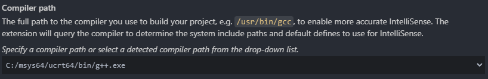
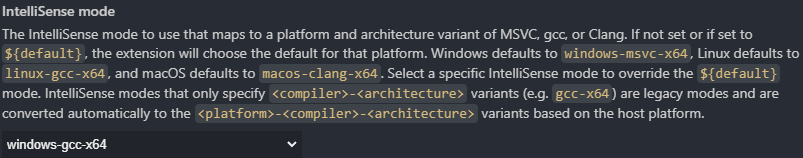
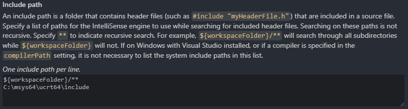
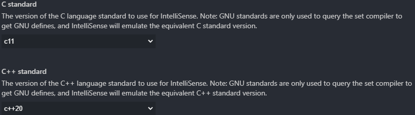
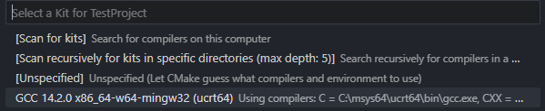

# Quick C++ Project Setup in Visual Studio Code without pain in several steps (Windows)

## Prequisites

- [**Visual Studio Code**](https://code.visualstudio.com/) IDE
- [**CMake**](https://cmake.org/) Software build system
- [**MSYS2**](https://www.msys2.org/) is a collection of tools and libraries providing you with an easy-to-use environment for building, installing and running native Windows software
- [**MinGW**](https://www.mingw-w64.org/) is a modern GCC compiler for Windows, supporting C++20

## Installation

### 0. Install Visual Studio Code

  Download and install from code.visualstudio.com.

### 1. Install Visual Studio Code Extensions
  - [**C/C++** extension](https://marketplace.visualstudio.com/items?itemName=ms-vscode.cpptools)
  - [**CMake** tools](https://marketplace.visualstudio.com/items?itemName=ms-vscode.cmake-tools)

### 2. Install CMake
  - Download the latest CMake installer.
  - Run the installer and check the option to `Add CMake to the system PATH for all users` (or for the current user).
  - Verify installation by opening a command prompt and running:

    ```bash
    cmake --version
    ```

You should see the CMake version (e.g., 3.31).

### 3. Install MSYS2 and MinGW-w64 compiler
  - Download the MSYS2 installer from msys2.org (e.g., `msys2-x86_64-20250221.exe`).
  - Run the installer, accepting the default directory (`C:\msys64`).
  - Open the **MSYS2 UCRT64** terminal from the Start menu (UCRT64 is recommended for newer Windows versions).
  - Update the package database:

    ```bash
    pacman -Syu
    ```

  - If prompted, close the terminal and reopen it to continue with the updates.
  - Install the toolchain:

    ```bash
    pacman -S --needed base-devel mingw-w64-ucrt-x86_64-toolchain
    ```

  - Add the MinGW-w64 bin directory to your Windows `PATH`:
    - `Start > System > Advanced system settings > Environment Variables`.
    - Under **User variables**, select **Path**, click **Edit**, and add `C:\msys64\ucrt64\bin`.
Click OK to save.
  - Verify the installation by opening a command prompt and running

    ```bash
    g++ --version
    ```

    You should see the GCC version (e.g., 14.2.0), confirming MinGW-w64 is set up.

### 4. Create project structure
  - Create a new project folder, e.g., cpp_project.
  - Inside the project folder, create a src directory.
  - Create a main.cpp file inside src with a simple C++ code:

```cpp
#include <iostream>

int main() {
    std::cout << "Hello, World!" << std::endl;
    return 0;
}
```

### 5. Configure Visual Studio Code

  - Lauch VS Code and select `File > Open Folder`, then choose a new project folder
  - Within the opened project press `Ctrl + Shift + P` and select `C/C++ Edit Configurations (UI)`. This will create `.vscode/c_cpp_properties.json` configuration file in the project folder and open C/C++ Configurations UI.
  - Provide the following settings:
    + Set compiler path to `C:/msys64/ucrt64/bin/g++.exe`

      

    + Set IntelliSense mode (autocomplete) to `windows-gcc-x64`

      

    + Add include path `C:\msys64\ucrt64\include`

      

    + Set C/C++ language standard to `c++20`

      

    The generated `.vscode/c_cpp_properties.json` file should look like:

```json
{
    "configurations": [
        {
            "name": "Win32",
            "includePath": [
                "${workspaceFolder}/**",
                "C:/msys64/ucrt64/include"
            ],
            "defines": [
                "_DEBUG",
                "UNICODE",
                "_UNICODE"
            ],
            "compilerPath": "C:/msys64/ucrt64/bin/g++.exe",
            "intelliSenseMode": "windows-gcc-x64",
            "cStandard": "c11",
            "cppStandard": "c++20"
        }
    ],
    "version": 4
}
```
### 6. Create a `CMakeLists.txt`

  + Create a `CMakeLists.txt` file in the project root with the following content:

    ```cmake
    cmake_minimum_required(VERSION 4.0.0)

    project(TestProject VERSION 0.1.0 LANGUAGES C CXX)

    set(CMAKE_CXX_STANDARD 20)
    set(CMAKE_CXX_STANDARD_REQUIRED ON)

    add_executable(${PROJECT_NAME} src/main.cpp)\
    ```

### 7. Configure CMake in VS Code

  + Press `Ctrl + Shift + P`, select `CMake: Configure`
  + Choose the kit: **GCC from MSYS2 UCRT64** or similar:

    

  + This should create a `build` folder.

### 8. Build the project

  - Press `Ctrl + Shift + P`, select `CMake: Build`.
  - The binary file should be generated in the `build` folder (e.g., `TestProject.exe`)
